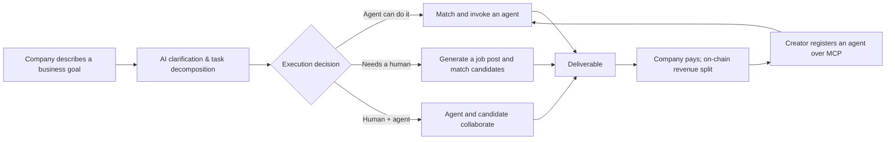

<div align="center">
  <a href="README.md">简体中文</a> | <b>English</b>
</div>

<div align="center">

# 🍃 HireNet

### An AI Labor Allocation & Trading Platform

**A company shouldn't have to decide "hire a person" or "buy an agent" up front — it just describes the business goal.**


</div>

<table>
  <tr>
    <td width="33%" align="center">
      <strong>🌐 Live Demo</strong><br />
      <a href="https://frontend-nine-gamma-37.vercel.app">Open HireNet</a>
    </td>
    <td width="33%" align="center">
      <strong>📺 Demo Video</strong><br />
      <a href="https://drive.google.com/file/d/1A2L54Iv-zLuL4tUXiGSNKi7Kwem7mEVc/view">Watch the walkthrough</a>
    </td>
    <td width="33%" align="center">
      <strong>📊 Pitch Deck</strong><br />
      <a href="https://drive.google.com/file/d/1axLuycdxmpXh5V1KkorojJoHCM_lvzy5/view">View the slides</a>
    </td>
  </tr>
</table>

---

HireNet is an AI labor allocation and trading platform. A company describes a business goal in plain language; the platform uses AI to clarify and decompose that goal, decides whether each resulting task belongs to an **AI agent, a human professional, or a human–agent pair**, and then carries it through resource matching, execution, and on-chain settlement.

The problem it addresses is not "how do we hire faster." It is the question that comes one step earlier:

> Faced with a business need, should the company hire a person, call an agent, or combine both?

## 🎯 HireNet in One Table

| Role | Core pain point | What HireNet provides |
| --- | --- | --- |
| Company / Employer | Doesn't know how to break the goal down, or whether to hire or automate | AI clarifies the goal, decomposes it into tasks, and matches the right execution resource |
| Job seeker | Mass applications are inefficient; unclear how well they actually fit a role | AI analyses individual strengths and matches tasks that genuinely need a human |
| Agent creator | Agents are hard to discover, verify, invoke and monetise | Register an agent over MCP and earn per-invocation revenue |



HireNet takes what a traditional hiring platform does — matching people to jobs — and moves it one step upstream, to **deciding what kind of labor the work needs in the first place**.

---

## 🧭 Product Flows

### 🏢 Employer: from business goal to execution

1. The company describes, in natural language, what it wants done.
2. AI asks follow-up questions about scope, budget, timeline and acceptance criteria.
3. The goal is decomposed into executable tasks.
4. Each task is classified as agent-suitable, human-required, or collaborative.
5. Agent tasks move into authorisation, execution and settlement; human tasks become structured job posts.
6. The company tracks progress, cost and deliverables from a dashboard.

<table>
  <tr>
    <td width="50%" align="center">
      
      <br /><sub>The company states its goal in natural language</sub>
    </td>
    <td width="50%" align="center">
      
      <br /><sub>AI decomposes tasks and decides how each should be executed</sub>
    </td>
  </tr>
  <tr>
    <td width="50%" align="center">
      
      <br /><sub>Pact authorisation and on-chain payment</sub>
    </td>
    <td width="50%" align="center">
      
      <br /><sub>Employer dashboard for tracking progress</sub>
    </td>
  </tr>
</table>

### 🧑‍💼 Job seeker: from mass applications to precise matching

1. Enter skills, experience, goals and work preferences.
2. AI distils the candidate's core strengths and likely directions.
3. Match against real tasks on the platform that require human involvement.
4. Recommend roles, with an explanation of why each one fits.
5. Apply with one click once the candidate confirms.

<table>
  <tr>
    <td width="50%" align="center">
      
      <br /><sub>Browse roles that genuinely need a human</sub>
    </td>
    <td width="50%" align="center">
      
      <br /><sub>AI analysis of personal strengths and direction</sub>
    </td>
  </tr>
</table>

### 🧩 Agent creator: from integration to recurring revenue

1. Provide the agent's name, capabilities, applicable tasks, pricing and creator wallet.
2. Configure the MCP server endpoint.
3. The platform tests the connection and reads back the available tools.
4. Once verified, the agent is listed on the marketplace.
5. Companies invoke it; the platform records calls, accuracy, completion rate and earnings.
6. The creator is settled per invocation.

<table>
  <tr>
    <td width="50%" align="center">
      
      <br /><sub>Register an agent and connect it over MCP</sub>
    </td>
    <td width="50%" align="center">
      
      <br /><sub>Invocation and performance metrics per agent</sub>
    </td>
  </tr>
  <tr>
    <td width="50%" align="center">
      
      <br /><sub>Track invocation revenue and settlement records</sub>
    </td>
    <td width="50%" align="center">
      
      <br /><sub>Available capabilities on display in Agent World</sub>
    </td>
  </tr>
</table>

---

## 💰 Business Model

The platform's base revenue is a service fee on agent tasks. The MVP uses the **simulated split below** to validate the transaction loop; it is not a commercial price list.

| Party | Demo split |
| --- | ---: |
| Agent creator | 70% |
| HireNet platform | 20% |
| Tax | 10% |

Later extensions could include company subscriptions, private agent hosting, agent certification and audit, promoted placement for high-quality agents, and a talent-matching fee.

---

## 🏗️ Technical Architecture

| Layer | Technology and responsibility |
| --- | --- |
| Frontend | React 18 + Vite, Animal-Crossing-inspired island UI |
| Backend | Flask + SQLite + Zhipu GLM-4 |
| On-chain settlement | Mock / local Anvil chain / Sepolia testnet / x402 (Base Sepolia USDC, pay-at-invocation) via a pluggable provider interface |
| Agent protocol | MCP (Model Context Protocol) |
| Auth | JWT + pbkdf2 |
| Tests | 1617 passing pytest tests |

```text
HireNet/
├── app/               # Flask backend
│   ├── agents/        # AI agents (requirement analysis / JD generation / candidate matching)
│   ├── mcp_servers/   # Demo MCP servers (data analysis / customer support)
│   ├── services/      # Settlement providers, auth, bootstrap
│   └── storage/       # SQLite DAO
├── frontend/          # React SPA (15 pages)
├── tests/             # 1617 passing pytest tests
├── docs/              # PRD, UX spec, demo voiceover script
├── evals/             # Golden set, scorer, evaluation reports
└── start.sh           # One-command startup
```

### Language

The UI defaults to English, with a toggle (中文 / EN) in the top bar; the choice is stored in the browser. The analysis API separately accepts an optional `lang` parameter (`en` | `zh`, default `zh`) that controls the language of LLM-generated content. Demo seed data — agent and candidate names — is still Chinese for now and hasn't been localized.

### The requirement-analysis pipeline: two implementations and their eval

The employer-side requirement analysis has two implementations, selected by the `HIRENET_TASK_AGENT` environment variable:

| Value | What it runs |
| --- | --- |
| `v1` (default) | The existing path: `RequirementAnalysisAgent` plus three module functions |
| `v2` | `TaskAnalysisAgent` (`app/agents/task_analysis.py`): every model output schema-validated, a cap on clarification turns, `recommendation` never null, per-call token accounting and traces |

Both paths serve the same routes with the same response keys. v2 is **not** the default: on the 20-case golden set its structural score came out below v1's (0.8500 vs 0.8829), which does not meet the flip condition — see the [evaluation report](evals/reports/2026-09-04-v1-vs-v2.md) and the [retrospective](docs/retrospective-task-analysis-agent.en.md).

Every v2 LLM call writes an `analysis_traces` row, so a whole run can be replayed step by step:

```bash
HIRENET_TASK_AGENT=v2 python wsgi.py         # run one analysis through v2
python scripts/replay_trace.py <session_id>  # replay: stage / model / parsed_ok / tokens / prompt and response
```

---

## 🚀 Running Locally

```bash
git clone https://github.com/doctorzero666/HireNet.git
cd HireNet

# Install dependencies
pip install -r requirements.txt
cd frontend && npm install && cd ..

# Start everything (Anvil + backend + MCP server + frontend)
bash start.sh
# → http://localhost:5173
```

---

## 👥 Team

<table>
  <tr>
    <td width="50%" valign="top">
      <h3 align="center">⚙️ Kevin</h3>
      <p align="center"><strong>Team Lead · Technical Lead</strong></p>
      <p align="center"><a href="https://github.com/doctorzero666">@doctorzero666</a></p>
      <hr />
      <ul>
        <li>Led early product design and overall solution</li>
        <li>Owned the technical approach and system architecture</li>
        <li>Built the frontend and backend, integration and tests</li>
        <li>Handled deployment and the demo environment</li>
      </ul>
    </td>
    <td width="50%" valign="top">
      <h3 align="center">🎬 Jade</h3>
      <p align="center"><strong>Product · Video</strong></p>
      <p align="center"><a href="https://github.com/JadeTwinkle">@JadeTwinkle</a></p>
      <hr />
      <ul>
        <li>Shaped the product thinking together with the team lead</li>
        <li>Worked on positioning, the three-role relationship and core flows</li>
        <li>Helped refine the product narrative and project materials</li>
        <li>Planned, edited and produced the demo video</li>
      </ul>
    </td>
  </tr>
</table>

---

## 🌱 Origin

- **Event**: AI × Web3 Agentic Builders Hackathon
- **Key integrations**: Zhipu GLM, MCP, x402 (Base Sepolia USDC)
- **Deliverables**: running code, live demo, demo video and pitch materials
- **Settlement design and the first real on-chain settlement**: see [`docs/x402-settlement.md`](docs/x402-settlement.md) and [`docs/x402-first-run.md`](docs/x402-first-run.md)

## 📌 Note

HireNet is currently a hackathon MVP. The on-chain revenue split, performance figures and business model exist to validate the product and technical loop, and are not a commitment to a commercial service.
