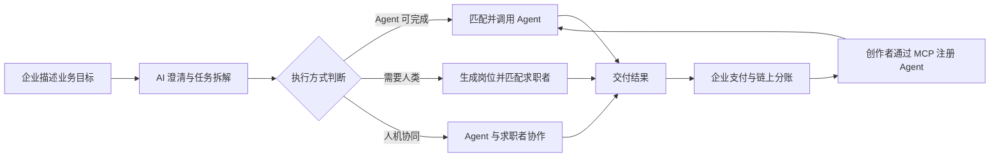

<div align="center">

# 🍃 HireNet

### AI 劳动力调度与交易平台

**企业不必先决定“招一个人”还是“买一个 Agent”，只需描述业务目标。**


</div>

<table>
  <tr>
    <td width="33%" align="center">
      <strong>🌐 在线体验</strong><br />
      <a href="https://frontend-nine-gamma-37.vercel.app">打开 HireNet Demo</a>
    </td>
    <td width="33%" align="center">
      <strong>📺 演示视频</strong><br />
      <a href="https://drive.google.com/file/d/1A2L54Iv-zLuL4tUXiGSNKi7Kwem7mEVc/view">观看完整 Demo</a>
    </td>
    <td width="33%" align="center">
      <strong>📊 答辩材料</strong><br />
      <a href="https://drive.google.com/file/d/1axLuycdxmpXh5V1KkorojJoHCM_lvzy5/view">查看答辩 PPT</a>
    </td>
  </tr>
</table>

---

HireNet 是一个 AI 劳动力调度与交易平台。企业用自然语言描述业务目标，平台通过 AI 澄清和拆解需求，判断每项任务应由 **AI Agent、人类人才或人机协同** 完成，并继续完成资源匹配、任务执行与链上结算。

它解决的不是“怎样更快招聘”，而是更前置的问题：

> 面对一个业务需求，企业应该招聘一个人、调用一个 Agent，还是采用人机协同？

## 🎯 一句话看懂 HireNet

| 角色 | 核心痛点 | HireNet 提供的价值 |
| --- | --- | --- |
| 企业 / 雇主 | 不知道如何拆解需求，也难以判断应该招人还是使用 Agent | AI 澄清目标、拆解任务并匹配合适的执行资源 |
| 求职者 | 海投低效，不清楚自身优势与岗位匹配度 | AI 分析个人优势，匹配真正需要人类参与的任务 |
| Agent 创作者 | Agent 难以被发现、验证、调用和商业化 | 通过 MCP 接入 Agent，获得调用收入和持续收益 |



HireNet 将传统招聘平台的“岗位匹配”，扩展成了更前置的**劳动力类型决策**。

---

## 🧭 产品流程

### 🏢 企业端：从业务目标到执行

1. 企业用自然语言描述希望完成的业务目标；
2. AI 主动追问场景、预算、周期和交付标准；
3. 将业务目标拆解成可执行任务；
4. 判断任务适合 Agent、人类还是人机协同；
5. Agent 任务进入授权、执行与结算，人类任务生成结构化岗位；
6. 企业在控制台查看进度、成本和交付结果。

<table>
  <tr>
    <td width="50%" align="center">
      
      <br /><sub>企业使用自然语言描述业务目标</sub>
    </td>
    <td width="50%" align="center">
      
      <br /><sub>AI 拆解任务并判断执行方式</sub>
    </td>
  </tr>
  <tr>
    <td width="50%" align="center">
      
      <br /><sub>Pact 授权与链上支付</sub>
    </td>
    <td width="50%" align="center">
      
      <br /><sub>企业控制台查看业务进度</sub>
    </td>
  </tr>
</table>

### 🧑‍💼 求职者端：从海投到精准匹配

1. 填写技能、经历、目标和工作偏好；
2. AI 提炼候选人的核心优势与发展方向；
3. 匹配平台中必须由人类参与的真实任务；
4. 推荐岗位并解释匹配原因；
5. 候选人确认后一键投递。

<table>
  <tr>
    <td width="50%" align="center">
      
      <br /><sub>浏览真正需要人类参与的岗位</sub>
    </td>
    <td width="50%" align="center">
      
      <br /><sub>AI 分析个人优势与发展方向</sub>
    </td>
  </tr>
</table>

### 🧩 Agent 创作者端：从能力接入到持续收益

1. 填写 Agent 名称、能力、适用任务、计费方式和创作者钱包；
2. 配置 MCP Server 端点；
3. 平台测试连接并读取可用工具；
4. Agent 通过验证后进入市场；
5. 企业调用 Agent，平台记录调用、准确率、完成率与收益；
6. 创作者按调用获得结算收入。

<table>
  <tr>
    <td width="50%" align="center">
      
      <br /><sub>注册 Agent 并接入 MCP 服务</sub>
    </td>
    <td width="50%" align="center">
      
      <br /><sub>查看 Agent 调用与性能数据</sub>
    </td>
  </tr>
  <tr>
    <td width="50%" align="center">
      
      <br /><sub>追踪调用收入与结算记录</sub>
    </td>
    <td width="50%" align="center">
      
      <br /><sub>在 Agent 世界展示可用能力</sub>
    </td>
  </tr>
</table>

---

## 💰 商业模式

平台的基础收入来自 Agent 任务服务费。MVP 使用以下**模拟分账规则**验证交易闭环，不代表正式商业定价：

| 参与方 | 演示分账比例 |
| --- | ---: |
| Agent 创作者 | 70% |
| HireNet 平台 | 20% |
| 税费 | 10% |

后续可扩展企业订阅、私有 Agent 接入与部署、Agent 认证与审计、优质 Agent 推广，以及人才匹配服务费。

---

## 🏗️ 技术架构

| 模块 | 技术与职责 |
| --- | --- |
| 前端 | React 18 + Vite + Island 动森风 UI |
| 后端 | Flask + SQLite + 智谱 GLM-4 |
| 链上结算 | Anvil 本地测试链（可切换 Cobo WaaS 2.0）|
| Agent 协议 | MCP (Model Context Protocol) |
| 鉴权 | JWT + pbkdf2 |
| 测试 | pytest 532 passed |

```text
HireNet/
├── app/               # Flask 后端
│   ├── agents/        # AI Agent（需求分析/JD生成/候选人匹配）
│   ├── mcp_servers/   # Demo MCP Server（数据分析/客服）
│   ├── services/      # 结算提供者/auth/bootstrap
│   └── storage/       # SQLite DAO
├── frontend/          # React SPA（15 个页面）
├── tests/             # pytest 532 passed
├── docs/              # PRD/UX Spec/Demo 配音脚本
└── start.sh           # 一键启动
```

---

## 🚀 本地运行

```bash
git clone https://github.com/doctorzero666/HireNet.git
cd HireNet

# 安装依赖
pip install -r requirements.txt
cd frontend && npm install && cd ..

# 启动全部服务（Anvil + 后端 + MCP Server + 前端）
bash start.sh
# → http://localhost:5173
```

---

## 👥 团队分工

<table>
  <tr>
    <td width="50%" valign="top">
      <h3 align="center">⚙️ Kevin</h3>
      <p align="center"><strong>队长 · 技术负责人</strong></p>
      <p align="center"><a href="https://github.com/doctorzero666">@doctorzero666</a></p>
      <hr />
      <ul>
        <li>主导项目前期产品设计与整体方案</li>
        <li>负责技术方案与系统架构设计</li>
        <li>负责前后端开发、系统集成与测试</li>
        <li>负责部署与演示环境搭建</li>
      </ul>
    </td>
    <td width="50%" valign="top">
      <h3 align="center">🎬 Jade</h3>
      <p align="center"><strong>产品 · 视频剪辑</strong></p>
      <p align="center"><a href="https://github.com/JadeTwinkle">@JadeTwinkle</a></p>
      <hr />
      <ul>
        <li>与队长共同讨论和梳理产品思路</li>
        <li>参与产品定位、三方角色关系与核心流程整理</li>
        <li>协助完善产品表达与项目材料</li>
        <li>负责 Demo 视频策划、剪辑与成片输出</li>
      </ul>
    </td>
  </tr>
</table>

---

## 🏆 Hackathon

- **赛事**：AI × Web3 Agentic Builders Hackathon
- **赛道**：Cobo Track
- **关键集成**：Cobo Agentic Wallet、智谱 GLM、MCP
- **交付物**：可运行代码、在线 Demo、演示视频与答辩材料

## 📌 说明

HireNet 当前为 Hackathon MVP。链上分账比例、性能指标与商业模式均用于验证产品和技术闭环，不构成正式服务承诺。
