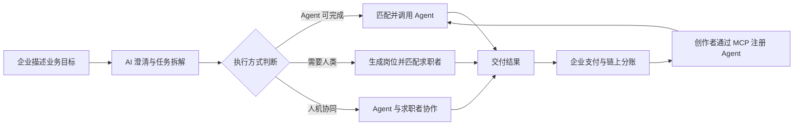

# 🍃 HireNet — AI 劳动力调度与交易平台

> 企业不必先决定“招一个人”还是“买一个 Agent”，只需描述业务目标。

[](https://www.python.org/)
[](https://flask.palletsprojects.com/)
[](https://react.dev/)
[](https://modelcontextprotocol.io/)
[](#hackathon)

**[在线体验](https://frontend-nine-gamma-37.vercel.app)** · **[Demo 视频](https://drive.google.com/file/d/1A2L54Iv-zLuL4tUXiGSNKi7Kwem7mEVc/view)** · **[答辩 PPT](https://drive.google.com/file/d/1axLuycdxmpXh5V1KkorojJoHCM_lvzy5/view)**

HireNet 是一个 AI 劳动力调度与交易平台。企业用自然语言描述业务目标，平台通过 AI 澄清和拆解需求，判断每项任务应由 **AI Agent、人类人才或人机协同** 完成，并继续完成资源匹配、任务执行与链上结算。

它解决的不是“怎样更快招聘”，而是更前置的问题：

> 面对一个业务需求，企业应该招聘一个人、调用一个 Agent，还是采用人机协同？

## 核心价值

| 角色 | 核心痛点 | HireNet 提供的价值 |
| --- | --- | --- |
| 企业 / 雇主 | 不知道如何拆解需求，也难以判断应该招人还是使用 Agent | AI 澄清目标、拆解任务并匹配合适的执行资源 |
| 求职者 | 海投低效，不清楚自身优势与岗位匹配度 | AI 分析个人优势，匹配真正需要人类参与的任务 |
| Agent 创作者 | Agent 难以被发现、验证、调用和商业化 | 通过 MCP 接入 Agent，获得调用收入和持续收益 |



HireNet 将传统招聘平台的“岗位匹配”，扩展成了更前置的**劳动力类型决策**。

## 产品流程

### 企业端：从业务目标到执行

1. 企业用自然语言描述希望完成的业务目标；
2. AI 主动追问场景、预算、周期和交付标准；
3. 将业务目标拆解成可执行任务；
4. 判断任务适合 Agent、人类还是人机协同；
5. Agent 任务进入授权、执行与结算，人类任务生成结构化岗位；
6. 企业在控制台查看进度、成本和交付结果。


### 求职者端：从海投到精准匹配

1. 填写技能、经历、目标和工作偏好；
2. AI 提炼候选人的核心优势与发展方向；
3. 匹配平台中必须由人类参与的真实任务；
4. 推荐岗位并解释匹配原因；
5. 候选人确认后一键投递。


### Agent 创作者端：从能力接入到持续收益

1. 填写 Agent 名称、能力、适用任务、计费方式和创作者钱包；
2. 配置 MCP Server 端点；
3. 平台测试连接并读取可用工具；
4. Agent 通过验证后进入市场；
5. 企业调用 Agent，平台记录调用、准确率、完成率与收益；
6. 创作者按调用获得结算收入。


## 核心能力

- **AI 需求澄清与任务拆解**：基于智谱 `glm-4-plus` 的多轮分析流程，将模糊目标转成结构化任务。
- **三类劳动力决策**：为每项任务判断 Agent 执行、人工执行或人机协同。
- **Agent 市场与 MCP 接入**：验证 MCP 端点、发现工具，并支持真实工具调用。
- **求职者优势分析与岗位匹配**：让岗位来自已拆解的实际任务，并解释匹配原因。
- **Pact 授权与结算**：覆盖创建、确认、执行、分账和状态查询的完整生命周期。
- **可替换结算层**：支持 Mock、Anvil 本地链、Sepolia 测试网与 Cobo WaaS。
- **收益账本与审计**：记录调用、分账、交易哈希和结算状态，便于追踪与对账。

## 商业模式

平台的基础收入来自 Agent 任务服务费。MVP 使用以下**模拟分账规则**验证交易闭环，不代表正式商业定价：

| 参与方 | 演示分账比例 |
| --- | ---: |
| Agent 创作者 | 70% |
| HireNet 平台 | 20% |
| 税费 | 10% |

后续可扩展企业订阅、私有 Agent 接入与部署、Agent 认证与审计、优质 Agent 推广，以及人才匹配服务费。

## 技术架构

| 模块 | 技术与职责 |
| --- | --- |
| Web 前端 | React 19、Vite 8、React Router 7 |
| API 服务 | Flask 3、REST API、JWT 鉴权 |
| AI 能力 | 智谱 `glm-4-plus`，支持通过环境变量切换兼容模型 |
| Agent 协议 | MCP 工具发现与调用 |
| 数据层 | SQLite、结构化 Schema、收益与审计账本 |
| Web3 结算 | Mock、Anvil、Sepolia、Cobo WaaS 可替换 Provider |
| 测试 | pytest，覆盖鉴权、MCP、Pact、结算、账本和端到端流程 |

```text
HireNet/
├── app/
│   ├── agents/          # 需求分析、岗位设计、候选人匹配
│   ├── mcp_servers/     # 客服与数据分析 Demo MCP Server
│   ├── routes/          # Agent、收益与审计 API
│   ├── services/        # 鉴权、MCP、Pact 与多 Provider 结算
│   ├── storage/         # SQLite 数据访问与账本
│   └── schemas/         # 核心业务对象 JSON Schema
├── frontend/            # React 单页应用
├── tests/               # 自动化测试
├── docs/                # PRD、UX、阶段规格与 Demo 材料
└── start.sh             # 本地一键启动脚本
```

## 本地运行

### 1. 环境要求

- Python 3.11+
- Node.js 20+
- npm
- 可选：Foundry / Anvil（仅在使用本地链结算时需要）

### 2. 安装依赖

```bash
git clone https://github.com/doctorzero666/HireNet.git
cd HireNet

python -m venv .venv
source .venv/bin/activate          # Windows PowerShell: .venv\Scripts\Activate.ps1
pip install -r requirements.txt

cd frontend
npm install
cd ..
```

### 3. 配置 AI（可选）

未配置 API Key 时仍可体验部分演示流程；如需调用真实模型，可设置：

```bash
export ZHIPU_API_KEY="your-api-key"
export ZHIPU_MODEL="glm-4-plus"
```

### 4. 启动

```bash
bash start.sh
```

启动后访问：

- 前端：`http://localhost:5173`
- 后端 API：`http://localhost:5001`
- Demo MCP Server：`http://localhost:5002`

默认使用 Mock 结算。如需本地链，将 `HIRENET_SETTLEMENT_PROVIDER` 设置为 `anvil`，并配置 `ANVIL_RPC_URL`、`ANVIL_FROM_KEY` 和 `ANVIL_TO_ADDRESS`。

## 测试与构建

```bash
pytest -q

cd frontend
npm run lint
npm run build
```

## 团队分工

| 成员 | 角色 | 主要贡献 |
| --- | --- | --- |
| [JadeTwinkle](https://github.com/JadeTwinkle) | 产品经理 / 产品设计 | 定义“AI 劳动力调度与交易平台”定位；设计企业、求职者、Agent 创作者三方模型；梳理 AI 需求澄清、任务拆解与劳动力类型决策流程；规划三端核心体验、MCP 接入与链上交易闭环；设计商业模式与演示叙事。 |
| [doctorzero666](https://github.com/doctorzero666) | 技术开发 / 工程实现 | 负责 Flask 后端、React 前端、AI Agent 工作流、MCP Server 接入、SQLite 数据层、Pact 授权与多 Provider 链上结算等工程实现，并完成自动化测试、部署与演示环境搭建。 |

## Hackathon

- **赛事**：AI × Web3 Agentic Builders Hackathon
- **赛道**：Cobo Track
- **关键集成**：Cobo Agentic Wallet、智谱 GLM、MCP
- **交付物**：可运行代码、在线 Demo、演示视频与答辩材料

## 说明

HireNet 当前为 Hackathon MVP。链上分账比例、性能指标与商业模式均用于验证产品和技术闭环，不构成正式服务承诺。
