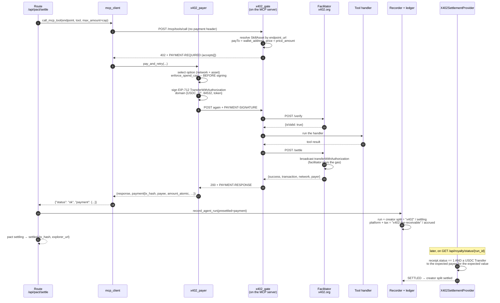

# x402 settlement — pay-at-invocation on Base Sepolia

Stage 2. How a SkillAsset invocation gets paid for in USDC before the caller
sees a result, what that guarantees, and — at least as important — what it does
not.

The first live payments are recorded in **[`x402-first-run.md`](x402-first-run.md)**:
two settled transactions on Base Sepolia, 0.01 USDC each, with the on-chain
receipts. Everything below describes the code that produced them.

## 1. The idea in one paragraph

Every other settlement rail in this repo is a **push**: the platform holds a
key, `/api/royalty/settle` calls `provider.settle()`, and money leaves the
platform's wallet after the work is done. x402 inverts that. The SkillAsset's
invocation endpoint is behind an HTTP 402 paywall; the **caller** signs an
EIP-3009 `transferWithAuthorization` for the asset's price, a facilitator
verifies it, the tool runs, the facilitator broadcasts the USDC transfer, and
the result comes back with the transaction hash attached. By the time HireNet
writes an `agent_runs` row, the creator has already been paid. The platform
never holds the money and never holds a key.

That is why the x402 provider's `settle()` **always refuses**: for this rail
there is genuinely nothing for the platform to submit. All it does is confirm.

## 2. The paid invocation, end to end



Two things in that diagram are load-bearing and easy to miss:

* **`enforce_spend_cap` runs before anything is signed.** A quote above the
  ceiling is refused while it is still just a number.
* **The facilitator pays the gas.** The payer's wallet held 0 ETH before and
  after both live runs; `tx.from` on both transactions is the facilitator's
  relayer `0xd407e409E34E0b9afb99EcCeb609bDbcD5e7f1bf`. EIP-3009 is gasless for
  the signer by design. The payer needs USDC and nothing else.

## 3. Environment variables

| variable | default | who reads it | what it does |
|---|---|---|---|
| `HIRENET_X402_GATE` | unset (**off**) | `app/mcp_servers/*.py` → `x402_gate.install_x402_gate` | Only the exact string `"1"` installs the paywall. Everything else in the repo behaves as if x402 did not exist. |
| `HIRENET_SETTLEMENT_PROVIDER` | `mock` | `create_app` → `settlement.get_provider` | Set to `x402` to make `/api/pact/settle` pay at invocation time and to let the status route confirm x402 runs. Any other value leaves the legacy post-hoc path untouched. |
| `X402_PAYER_PRIVATE_KEY` | unset | `mcp_client` (read, passed down, never stored) | The caller's key. **Unset means a 402 is surfaced as an error, never a silent unpaid retry.** Lives in the untracked `.env`; never printed, never logged, never in an exception message. |
| `X402_MAX_AMOUNT_PER_PAYMENT` | `1000000` (1 USDC) | `x402_payer.max_amount_per_payment` | Per-payment ceiling in atomic units — the operator's wallet-level brake. A pact's own `amount_cap` may lower it, never raise it. |
| `X402_NETWORK` | `eip155:84532` | gate, payer, provider | CAIP-2 network id. v2 uses CAIP-2; the v1 string `base-sepolia` is not what this code speaks. |
| `X402_USDC_ADDRESS` | `0x036CbD53842c5426634e7929541eC2318f3dCF7e` | gate, payer, provider | The token. The gate **refuses to boot** against any other address, because it advertises USDC's EIP-712 domain (`name="USDC"`, `version="2"`) and would otherwise be quoting a domain it guessed. |
| `X402_FACILITATOR_URL` | `https://x402.org/facilitator` | gate | Public, free, no API key for Base Sepolia. Best-effort: a shared testnet convenience service with no SLA. |
| `X402_RPC_URL` | `https://sepolia.base.org` | provider, `scripts/x402_wallet.py` | Where receipts are read. Only ever read from; nothing is broadcast here. |
| `X402_EXPLORER_TX_URL` | `https://sepolia.basescan.org/tx/{tx_hash}` | `x402_settlement.explorer_url` | Link template. `{tx_hash}` is substituted; without the placeholder the hash is appended as a path segment. |
| `X402_PAYER_ADDRESS` | unset | `scripts/x402_wallet.py balance` only | Convenience so `balance` needs no argument. Never used by the app. |
| `X402_E2E_PAYEE` | unset | `scripts/x402_e2e.py` only | The demo asset's `payTo`. There is deliberately no default. |
| `HIRENET_MCP_ENDPOINT_URL` | `http://localhost:5002` | `app/mcp_servers/customer_service.py` | The `endpoint_url` the gate matches a `skill_assets` row on. It must equal the registered asset's `endpoint_url` or the gate finds no payee and answers 503. |
| `HIRENET_DB_PATH` | `~/.hirenet/hirenet.db` | backend and the standalone MCP servers | Both processes must point at the **same** database: the gate reads `skill_assets` from it to find `payTo`. |

## 4. Units — the `10_000` invariant

Three different units meet on this path, and confusing them is how money goes
missing. There is exactly one conversion, defined once in
`x402_gate.usd_to_atomic`:

| quantity | unit | example |
|---|---|---|
| `skill_assets.price_amount` | integer **cents** (this repo's "基点") | `1` = $0.01, `4000` = $40 |
| pact `amount` / `amount_cap` | **dollars**, as floats (the existing pact convention) | `0.01` |
| x402 wire `amount` | **atomic USDC**, a *string*, 6 decimals | `"10000"` |
| `agent_runs.charge_amount` | integer **cents** | `1` |

```
atomic = round_half_up(dollars * 10**6)          # usd_to_atomic
dollars = price_amount / 100                     # asset_price_atomic
⇒ USDC_ATOMIC_PER_CENT = 10_000                  # agent_run_recording
```

`record_agent_run` re-asserts that invariant against the `presettled` payment
and refuses to write the row if the atomic amount is not a whole number of
cents. Every division happens in `Decimal`; no float is ever used for money.
The quoted amount is copied to the signature **verbatim as the string it
arrived as** — never re-formatted, never re-parsed into a number.

**One consequence worth knowing before a demo:** the split rule divides an
integer number of cents and gives the floor-division remainder to the platform
(`RemainderStrategy.PLATFORM_ABSORBS`). At the 1-cent minimum there is nothing
to divide, so a 70/20/10 rule yields creator `0`, platform `1`, tax `0` — while
the creator was nevertheless paid the whole cent on-chain. Coherent (the
creator owes that cent back as a receivable), but it reads strangely next to
the explorer. Price the demo asset above a few cents if the ledger is on screen.

## 5. The platform-fee limitation (single payee)

The x402 `exact` scheme pays **one** address. The 402 quote carries one
`payTo`, the signed authorization names one recipient, and the resulting
`Transfer` credits one account: the creator's wallet.

HireNet's revenue split has three parties. So on this rail:

* the **creator** row is written with `settlement_method = "x402"`, the real
  transaction hash, and status `settling` → `settled` once the chain confirms;
* the **platform** and **tax** rows are written as `accrued` with
  `settlement_method = "x402-fee-receivable"` and a note naming the transaction
  and the payee. **No on-chain transfer paid them.** They are receivables from
  the creator, and calling them anything else would be a lie the ledger tells
  its own auditor.

Two guards keep that honest, both regression-tested:

* `/api/royalty/settle` refuses to act on an `x402` run unless the configured
  provider is the x402 provider — otherwise a mock provider could mark an x402
  creator share settled;
* `confirm_settlement`'s accrued fallback **skips** rows whose
  `settlement_method` is `x402-fee-receivable`, so no rail can ever flip a
  receivable to `settled` as a side effect.

Phase 4 fixes this properly with a splitter contract (or a second transfer)
that pays all three parties from one authorization. Until then the receivable
is the accurate description.

## 6. `PaymentOutcomeUnknown` — the reconciliation procedure

The dangerous state in any payment system is not "it failed". It is **"we
signed something, put it on the wire, and never found out"**. Retrying signs a
second authorization with a fresh nonce; if the first one settled out of band,
the creator is paid twice.

`x402_payer` raises `PaymentOutcomeUnknown` (a `PaymentFailed` subclass,
carrying the nonce) for exactly four situations, all of them *after* the signed
authorization was transmitted:

1. the paid retry raised a transport error (a read timeout says nothing about
   whether the facilitator settled);
2. a non-402 response carrying a `PAYMENT-RESPONSE` we cannot decode;
3. a 2xx response with no `PAYMENT-RESPONSE` at all;
4. `success: true` with an **empty** `transaction` — told it worked, given
   nothing to verify it with.

An explicit **402 on the paid retry is not unknown**: that is the server
stating "I am not paid", and it is the only post-signing outcome that returns
the caller to retriable.

What each layer does with it:

| layer | behaviour |
|---|---|
| `mcp_client` | returns `status: "unknown"` (**not** `"error"`) with `payment_pending = {nonce, payee, amount_atomic, error}` |
| `_pact_settle_x402` | leaves the pact at **`settling`** — never back to `approved` — writes `last_error` and `payment_pending`, logs the nonce, and returns **502** with `"payment outcome unknown; manual reconciliation required"` |

**Reconciling by hand** (there is deliberately no automatic recovery — only a
human can decide whether that money moved):

1. read the pact row: `status = "settling"`, `payment_pending.nonce`,
   `payment_pending.payee`, `payment_pending.amount_atomic`;
2. look for a USDC `Transfer` to that payee for that value on Base Sepolia
   around that timestamp (basescan, or the payee's transaction list). Circle's
   USDC also emits `AuthorizationUsed(authorizer, nonce)` on a successful
   `transferWithAuthorization`, so the nonce identifies the exact authorization;
3. **if it settled**: the creator has been paid and no run row exists. Record
   the run out of band (or accept the gap) and move the pact to `settled` with
   that hash. Do not re-run settle;
4. **if it did not settle**: the authorization is still redeemable until its
   `validBefore` (now + `maxTimeoutSeconds`, 300 s in our quotes). Wait for that
   to pass, then the pact can safely be returned to `approved` and retried.

The pact staying claimed at `settling` is what makes step 4 safe: nothing else
can sign a second authorization for that mandate in the meantime.

## 7. Known limitations

Each of these is a deliberate boundary, not an oversight. The review ids are
from `scratchpad/stage2/02-merge-review.md`.

* **F5 — chunked request bodies break the gated route.** `_read_body_once`
  reads exactly `CONTENT_LENGTH` bytes so the inner Flask handler can read the
  body again. A chunked request has no `Content-Length`, so the body is
  discarded and the tool call answers `400`. It **fails closed** — no unpaid
  result is ever returned — but it is a functional break for a chunked client.
  `requests` and `httpx` both set `Content-Length` when given `json=`, which is
  why no test and neither live run hit it. Fix when a real client needs it:
  read the stream to EOF when `HTTP_TRANSFER_ENCODING` is `chunked`.
* **F9 — the spend cap is per payment only.** `X402_MAX_AMOUNT_PER_PAYMENT`
  bounds one authorization. N invocations each just under the cap are unbounded
  in aggregate; there is no rolling or daily ceiling. Phase 4 wallet work.
* **No confirmation depth.** `check_status` promotes to SETTLED on a receipt
  with `status == 1` and a matching `Transfer`, however new the block is — in
  the live run, on the first poll. A reorg after one block would leave a run
  marked settled. Base Sepolia is a testnet demo; a mainnet deployment must add
  a depth check (`SepoliaSettlementProvider` already has the knob).
* **`endpoint_url` is not unique.** The gate resolves a payee by matching
  `skill_assets.endpoint_url`, and `list_skill_assets` orders by `created_at
  DESC`, so if two rows claim the same endpoint the **newest** is paid. The
  real fix is a uniqueness constraint or an explicit tool→asset table.
* **`check_status` does not verify the sender.** The facilitator broadcasts, so
  `tx.from` is its relayer; only the `Transfer` log's `to` and `value` are
  checked (the log's `from` is the authorizer, and the live run confirms it is
  the payer — but settlement is not gated on it).
* **Testnet only.** There is no mainnet configuration anywhere in this repo,
  by design.

### A naming collision to be aware of

`content_hash` means two unrelated things:

* **`skill_assets.content_hash`** — the provenance hash of a registered asset's
  content (the domain term in CLAUDE.md);
* **`pact["content_hash"]`** — an integrity digest over the pact's
  `PACT_HASHED_FIELDS` (`pact_id, task_id, asset_id, amount_cap, currency,
  payee, expires_at`), checked at settle.

They share a name and nothing else. Note also what the pact digest covers:
`amount` is **not** in it, deliberately. The digest bounds the **ceiling**
(`amount_cap`) and the identity fields, not the charged amount; a tampered
`amount` is caught by the separate `amount <= amount_cap` check against that
hashed cap.

## 8. What is verified how

Three very different kinds of evidence. The columns are not interchangeable and
the table exists so nobody reads a green suite as proof of a payment.

| claim | unit-tested (stubbed) | live facilitator | on-chain |
|---|---|---|---|
| 402 carries our network, asset, the creator's `payTo` and the atomic price | ✅ `tests/test_x402_gate.py` | ✅ decoded quote in `x402-first-run.md` §1 | n/a |
| EIP-712 payload matches the SDK's algorithm byte for byte | ✅ `tests/test_x402_payer.py` (transcribed algorithm) | ✅ the facilitator accepted the signature on the first attempt, twice | n/a |
| spend cap refuses an over-cap quote before signing | ✅ `tests/test_x402_payer.py`, `tests/test_x402_scripts.py` | not exercised (both quotes were at the cap) | n/a |
| verify → handler → settle ordering, and 402 when settle fails | ✅ `tests/test_x402_gate.py` | ✅ 402 → 200 + `PAYMENT-RESPONSE`, 1.4 s | n/a |
| a facilitator settles our authorization at all | ❌ stub only | ✅ **twice** | ✅ `0x7f2ac576…`, `0x7f429da8…` |
| USDC actually moves to the creator's wallet | ❌ | ✅ per the settle response | ✅ `Transfer` payer→payee, `10000`, receipt `status = 1` |
| the payer needs no ETH (facilitator pays gas) | n/a | n/a | ✅ payer held 0 ETH throughout; `tx.from` = the facilitator relayer |
| run + creator split born `settling` / `x402`, receivables `accrued` | ✅ `tests/test_x402_settlement.py`, `tests/test_pact_x402_settle.py` | ✅ rows in `x402-first-run.md` §2 | n/a |
| `check_status` promotes only on a matching `Transfer` | ✅ (injected fake `w3`) | n/a | ✅ SETTLED on a real receipt |
| status route flips the creator row `settling → settled` | ✅ | ✅ | ✅ |
| a chain-FAILED x402 run cannot be settled by another rail | ✅ (the reviewer's probe, now a test) | not exercised | not exercised |
| `PaymentOutcomeUnknown` freezes the pact at `settling` | ✅ route-level tests | not exercised — no live run produced it | n/a |

## 9. Running it

`scripts/x402_wallet.py` — the payer wallet.

```bash
# Generate a key. It is NEVER printed: stdout ends up in scrollback, shell
# history, CI artefacts and agent transcripts. Without --write-env the key is
# discarded and you only learn the address it would have had.
python scripts/x402_wallet.py new --write-env .env      # 0600, appends both names

# Read-only balances (USDC + native) for X402_PAYER_ADDRESS, or an argument.
python scripts/x402_wallet.py balance
python scripts/x402_wallet.py balance 0x…
```

Funding is a human step: <https://faucet.circle.com>, network **Base Sepolia**,
token **USDC**, 20 USDC per address per 2 hours. **No Base Sepolia ETH is
needed.** `balance` prints that instruction whenever USDC is 0.

`scripts/x402_e2e.py` — one real payment, end to end. It builds a temp SQLite
database with exactly one SkillAsset (1 cent, `wallet_address` = the payee) and
serves the real demo MCP server with the real gate on a localhost socket, so
the payment crosses real HTTP to the real facilitator. Nothing is stubbed.

```bash
export X402_E2E_PAYEE=0x…            # no default; the script refuses without it

python scripts/x402_e2e.py --mode direct --dry-run   # prints the quote, signs nothing
python scripts/x402_e2e.py --mode direct             # ONE 0.01 USDC payment
python scripts/x402_e2e.py --mode pact               # the same, through /api/pact/*
```

* `--max-usdc 0.01` (default) is a hard ceiling on the quote.
* Every refusal — no payee, no key, balance below the price, quote above the
  cap, or a quote whose network/asset/`payTo`/amount is not the seeded one —
  fires **before** anything is signed.
* Exit code 0 means SETTLED (or a valid dry-run quote). `3` is
  `PaymentOutcomeUnknown` and means *do not re-run*: reconcile the printed
  nonce first (§6).
* `--mode pact` injects a 120 s MCP timeout through the `MCP_CLIENT` seam
  because the route's shipped default is 5 s; `--pact-timeout 0` turns that
  injection off and uses the shipped path exactly. See
  `x402-first-run.md` §4 for why that default is worth revisiting.

Running the demo stack with the gate on:

```bash
export HIRENET_X402_GATE=1                  # paywall POST /mcp/tools/call
export HIRENET_SETTLEMENT_PROVIDER=x402     # settle pays at invocation time
export X402_PAYER_PRIVATE_KEY=0x…           # or put it in .env
./start.sh
```

The registered SkillAsset's `endpoint_url` must equal the MCP server's
`HIRENET_MCP_ENDPOINT_URL` and its `wallet_address` must be set — otherwise the
gate has no payee and answers `503` rather than inventing one.
